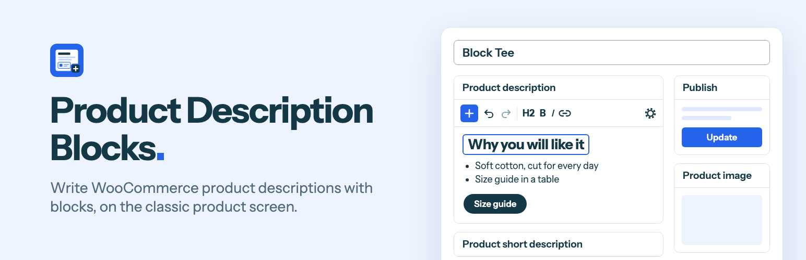

# Product Description Blocks for WooCommerce

Write WooCommerce product descriptions and short descriptions with blocks, on the classic product screen.

Activate the plugin and the two description boxes become block editors. You get headings, lists, images, tables, buttons and columns in your product copy. The rest of the screen stays where it is: Product data, the publish box, the gallery, categories and the meta boxes your extensions add.

## How it works

Each editor keeps its form field (`content`, `excerpt`) in sync as block markup. The product form posts those fields with everything else, so price, Featured, catalog visibility, the gallery and variations are saved by the same Update button as before.

- **Existing descriptions are safe.** A description written in the classic editor is shown as blocks, and is only saved as blocks once you edit it.
- **The short description renders on the storefront.** WooCommerce does not render blocks there by itself, so the plugin does. On a block theme, the product's own page keeps the formatting that the Post Excerpt block would otherwise flatten.
- **It stands aside when it should.** Product screens that already use the block editor, and users who turned off the visual editor, are left alone.

There is no build step. The editor is one script that uses the `wp.*` packages WordPress ships: a `BlockEditorProvider` over a block list, with a fixed toolbar and the inserter as a popover.

## Limits worth knowing

- The editors draw blocks with WordPress's default block styles, so fonts and colours can differ from the storefront.
- Only the blocks that come with WordPress load in these editors.
- Panels that belong to the full post editor, such as an SEO plugin's sidebar, are not available here.

## Filters

| Filter | What it does |
| --- | --- |
| `pdblocks_allowed_block_types` | Blocks an editor offers. Receives the list and the editor (`description` or `short_description`). |
| `pdblocks_format_post_excerpt_block` | Return `false` to let the Post Excerpt block show the short description as plain text on the product page. |

## Requirements

WordPress 7.0 or later, WooCommerce 11.1 or later, PHP 7.4 or later. Tested on WordPress 7.1.2 with WooCommerce 11.1.2.

## Install

Build the plugin as shown below, zip `build/product-description-blocks-for-woocommerce`, and upload it under Plugins > Add New > Upload Plugin. Or copy that folder into `wp-content/plugins`.

## Develop and test

Build the files that ship, without tests, design sources or repo files:

```bash
rsync -a --delete --exclude-from=.distignore ./ build/product-description-blocks-for-woocommerce/
```

Start a disposable store with [WordPress Playground](https://wordpress.github.io/wordpress-playground/). It installs WooCommerce and Plugin Check, mounts the build and logs you in:

```bash
npx @wp-playground/cli@3.1.56 server --port=9402 --workers=1 --login --blueprint=./tests/blueprint.json --mount=./build/product-description-blocks-for-woocommerce:/wordpress/wp-content/plugins/product-description-blocks-for-woocommerce --mount=./tests:/wordpress/wp-content/pdblocks-tests
```

Then, in the browser:

- `http://127.0.0.1:9402/wp-admin/admin-post.php?action=pdblocks_seed` adds two sample products.
- `http://127.0.0.1:9402/wp-admin/admin-post.php?action=pdblocks_run` runs the checks in `tests/run.php`.
- Tools > Plugin Check runs the WordPress.org checks.

## Directory assets

`.wordpress-org/` holds the WordPress.org icon and banner. `icon.svg` is the icon's source. The banners are rendered from `design/banner.html` at 1544 x 500, and at 772 x 250 with `?scale=0.5`. The type is Instrument Sans, under the SIL Open Font License.

## Licence

GPL-2.0-or-later. See [LICENSE](LICENSE).
